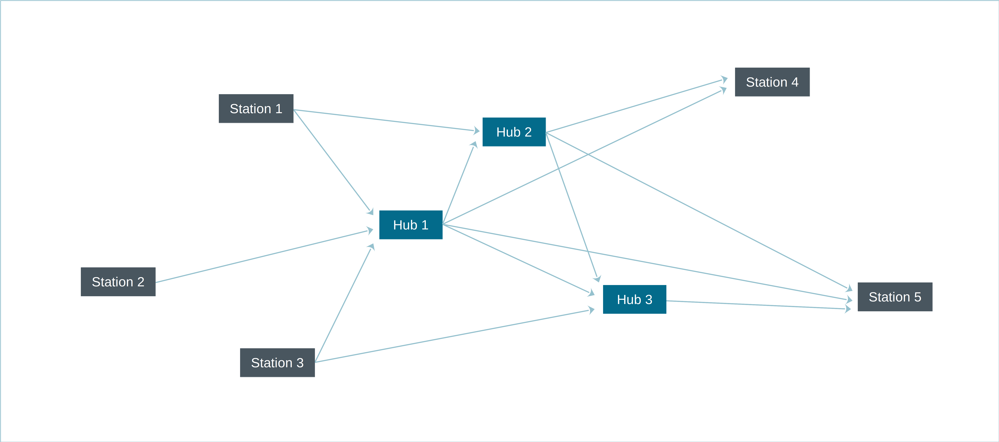

# Network Flow Problems
Many real-world problems can be modeled as a network flow problem. Here are 
a few examples:
- What is the shortest path to drive from work to home?
- What is the most economical way for the courier to deliver a package you 
  shipped to a friend that lives in another state?
- What is the maximum amount of data that can be transferred through a given 
  communication network?

One thing in common among these problems is that they all have an 
underlying network, i.e., a set of nodes and a set of arcs that connect 
these nodes. And the goal is to optimally move some type of flow through this 
network.

Here is a simple contextualized example to start with:
[SoyKing](https://www.mipwise.com/use-cases/soyking).

The network in the case of the SoyKing problem is composed by five nodes and 
six arcs. One thing to notice is that some nodes are **sources** (origin of flow)
and some are **sink** (destination of flow).

Many network flow problems, however, have a third type of node called 
**intermediate** nodes.

Next, we study a small use case to gradually build the foundation to solve 
network flow problems.

## MipEx
MipEx is a courier company that operates on the following network:

The transit distance, transit time, transportation cost, and the maximum 
number of trucks that can travel on each arc in a day are given in the 
[Transportation Lanes](data/transportation_lanes.csv) table.

### Shortest Path
What's the fastest way for MipEx to ship a package from Station 1 to Station 5?

### Min Cost
MipEx now needs to ship 3 trucks from Station 1 and 4 trucks 
from Station 3 to Station 5.

What's the most economical way for MipEx to ship the orders without exceeding 
the maximum number of available trucks on each lane?

### Max Flow
What is the maximum number of trucks that MipEx can ship from Station 1 and 
3 to Station 5 in a single day?

What is the maximum number of trucks that MipEx can ship from Station 1, 2 
and 3 to Station 5 and 4 in a single day?

### Multi-Commodities Flow
MipEx now needs to ship 3 trucks of a commodity from Station 1 to Station 5 
and 4 trucks of a different commodity from Station 3 to Station 4.

In addition, the commodities that go from Station 1 to Station 5 
require a special type of truck that increases the transportation cost by 
20%.

What's the most economical way for MipEx to ship the orders without exceeding 
the maximum number of available trucks?

The [Commodities](data/commodities.csv) table contains the relevant data to 
solve this problem.

## Arc Vs. Path-based Formulation
The formulations we have used so far (see [formulations](formulations) 
directory) are called **arc-based formulations**. In fact, decision variables 
are defined for each arc of the network. Feasible flow paths are then 
defined **implicitly** with the flow balance constraints.

While the arc-based formulation is quite clean and intuitive, it may not 
perform very well in practice for large-scale problems, especially as more 
complexities are added to the model (routing problems with time windows will 
be an example of that).

One alternative to the arc-based formulation is the called **path-based 
formulation**. In this case, the set of feasible paths for each 
origin-destination must be provided as input. The decision is then to decide 
which path to choose. As one can imagine, the challenge with this approach 
is to generate all feasible paths. There can be an astronomical number of 
them depending on the size of the network and types of requirements.

In practice, however, there are ways (or even strong reasons, in some cases)
to restrict the number of arcs that are generated and fed to the model. 
While restricting the number of paths can yield suboptimal solutions, it 
also gives the flexibility to strike a trade-off between accuracy and 
tractability.

In the end, the right approach depends a lot on the specific use case, and 
the final conclusion requires systematic experimentation. We will revisit 
this topic later in the program.

------------------------------------------------------------------------------

In the next section, we will study routing problems.

### [Up][up] | [Back][back] | [Next][next] | [Help][help]

[up]: ../README.md
[back]: ../0_formulation_template/README.md
[next]: ../2_routing_problems/README.md
[help]: ../../0_help/README.md