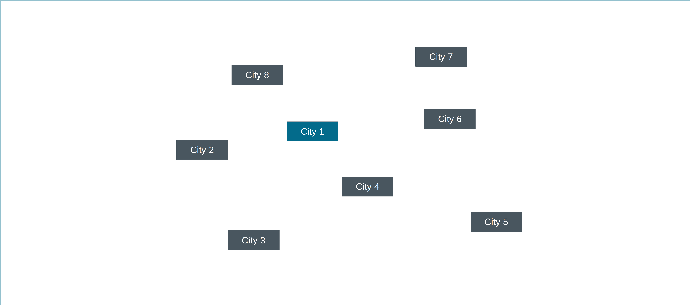

# Routing Problems
Routing problems are especial cases of network flow problems. We have a 
dedicates section to study routing problems for two reasons:
1) It's of big relevance in practice, in particular in last-mile delivery;
2) The underlying network typically has cycles, which adds a great deal 
   of complexity and require special treatment.

A practical example of a routing problem, a vehicle routing 
problem in this case, is the 
[GrabBro](https://www.mipwise.com/use-cases/grabbro) use case. In this 
problem, the goal is to determine the best route for a single driver to pick up 
multiple items from multiple grocery stores.

Another example, slightly more involving, is the
[Woodler](https://www.mipwise.com/use-cases/woodler) use case. In this
problem, the goal is to optimally allocate trucks to deliver products to
multiple demand locations. Because trucks have limited capacity, multiple 
trucks are typically required and, in which case multiple routes will compose 
the final solution.

But even before going into these use cases, let's visit the most basic 
and classic version of a routing problem, the Traveling Salesman Problem (TSP).

## Traveling Salesman Problem (TSP)
Starting from City 1, a traveling salesman must visit all the other 7 cities 
and return to City 1. The cost of traveling between any pair of cities is 
given in the [Transit Matrix](data/tsp/travel_costs.csv) table. Which route 
should the salesman take to minimize the total cost of his tour?

------------------------------------------------------------------------------

In the next section, we will study multi-period problems.

### [Up][up] | [Back][back] | [Next][next] | [Help][help]

[up]: ../README.md
[back]: ../1_network_flow_problems/README.md
[next]: ../3_multi_period_problems/README.md
[help]: ../../0_help/README.md

## Luiz's questions and observations

**Remark**: I guess the main problem regarding sub-tours is not the cycles, but the disjunction between the moves, 
which in practice doesn't make any sense, because the salesperson would need to teleport. 

1. I've been thinking about a possible alternative to the DFJ constraints, which hopefully would do the same job 
(prevent sub-tours) but as a slightly different set of constraints: for each subset S of nodes (except unitary sets 
   and the sets containing all the nodes to be visited), we add the constraint \sum_ij x_ij >= 1, where the 
   summation is over origin nodes "i" in the set S and destination nodes "j" in the complement of S. Intuitively, this seems to prevent us of having disconnected cycles. 

These constraints can be used in question 2) without removing the solution which takes both edges C8 -> C9 and C9 -> C8.

2. Let's say we have one more city (call it "City 9", C9 for short) which is a remote city, that is, either there is 
just one edge leading to C9, let's say C8 -> C9 and C9 -> C8, or there are more edges but very expensive ones. This way, since preventing sub-tours through DFJ or MTZ in particular avoids the salesman to take both edges C8 -> C9 and C9 -> C8, we could have an infeasible model or a not optimal solution in practice, i.e., it would probably be better (or necessary) to indeed take both edges C8 -> C9 and C9 -> C8. What should we do in this case?

   **Answer:** there are a few options: 

2. I've been thinking about a possible alternative to the DFJ constraints, which hopefully would do the same job 
(prevent sub-tours) but as a slightly different set of constraints: for each subset S of nodes (except unitary sets and the sets containing all the nodes to be visited), we add the constraint \sum_ij x_ij >= 1, where the summation is over origin nodes "i" in the set S and destination nodes "j" in the complement of S. Intuitively, this seems to prevent us of having disconnected cycles.
These constraints could be used in question 1) without removing the solution which takes both edges C8 -> C9 and C9 -> C8.

3. I have another formulation to propose (for the salesman problem): let's define x_ij as the number of times (integer, non-negative) the salesman takes the edge from node "i" to node "j" (it was binary previously, indicating that it would be at most one. Now I'm proposing that we can take the same edge more than one time). The idea is to allow the salesman to visit the same node and take the same edge more than one time. The flow balance constraint remains the same, and the constraint to ensure the salesman will visit the necessary nodes would be: \sum_j x_ij >= 1 for each node "i", i.e., it departs from each node (that is has to visit) at least one.
Now, the sub-tour elimination constraints could be those presented in 2), instead of the other DFJ.

4. In case our network has at least one node that the salesman don't necessarily need to visit, say City 10 (C10), adding DFJ constraints for ALL subsets (except unitary ones and the whole set of nodes) would remove those feasible solutions that don't visit C10 (because moving, for example, in the order C1, C2, C3, ..., C7, C8, C1 is a indeed a cycle, but it's a special cycle we don't want to remove).
In this case, I guess the solution is to add the DFJ constraints to all subsets of nodes, except those unitary, and also except those subsets that contain all the nodes to be visited.

