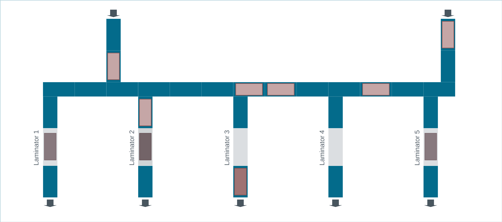

# Multi-Period Problems
Very often we want to make decisions over a time horizon when decisions made 
for one time period may impact decisions for other periods. 

A good example are production problems where there is the option to hold 
inventory from one period to the next. The 
[Pastesian](https://www.mipwise.com/use-cases/pastesian) and the 
[Frisbee Square](https://www.mipwise.com/use-cases/frisbee-square) use cases 
illustrate this situation very well.

One thing that become apparent as soon as we start to solve these problems 
is that there is an underlying network where nodes are period in time and 
arcs are links between there period--it's typically helpful to picture that 
network when solving the problem. As a result, flow balance constraints 
always show up in the formulation of these problems.

Transportation problems, including routing, will often have a time component 
too. For example, when there are time windows to pick up or delivery. In 
this case, the underlying network spans in space and time.

## Mip Solar
Mip Solar manufactures solar panels. One of the production stages is to heat 
the panel so that different layers of the material melt together. This 
heating process occurs inside the so-called laminators, and we assume it 
lasts 10 seconds.

Panels move from the previous production stage to laminators over conveyors. 
Each conveyor operates independently, meaning that a conveyor can move a panel 
back and forth at any time. Additionally, a panel can stay on a conveyor for 
as much time as needed, and it takes 1 second for a panel to move from one 
conveyor to another.

The planers at Mip Solar want to maximize the throughput of solar panels.

*OBS: This is a simplified version of a problem that Mip Wise solved for one of 
its clients. We presented it here just to illustrate a relevant real-world 
application of the topic being studied in this module. But due to 
contractual reasons, we won't solve this problem.*
------------------------------------------------------------------------------

In the next section, we will study scheduling problems.

### [Up][up] | [Back][back] | [Next][next] | [Help][help]

[up]: ../README.md
[back]: ../2_routing_problems/README.md
[next]: ../4_scheduling_problems/README.md
[help]: ../../0_help/README.md